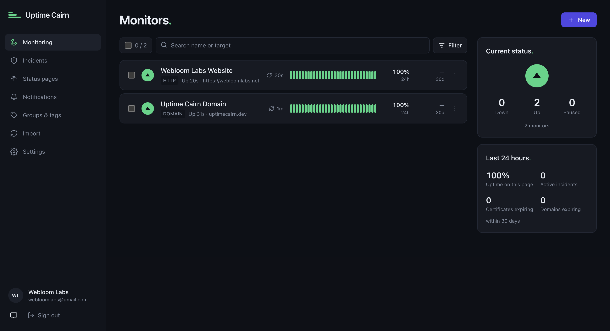
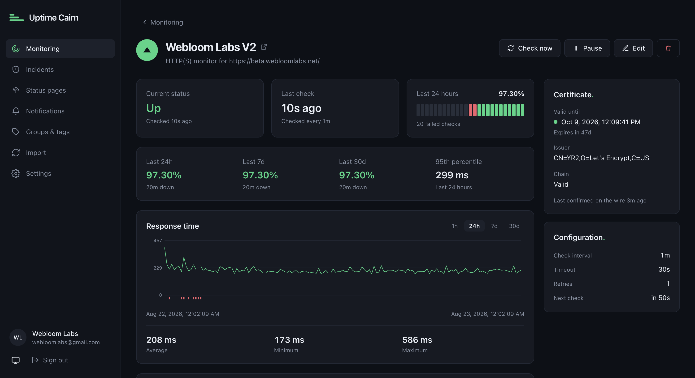
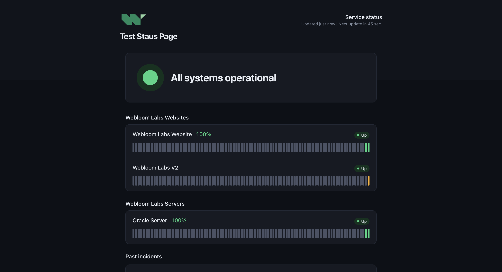

<div align="center">
    
</div>

# Uptime Cairn

**Uptime Cairn tells you when your websites and servers go down, and shows your
customers a status page that says so.**

Free, open source, and self-hosted. One Docker container, one file of data, no
database server to set up. Running in about a minute.

[](LICENSE)
[](https://github.com/webloomlabs/uptime-cairn/releases)
[](https://github.com/webloomlabs/uptime-cairn/actions/workflows/ci.yml)



## What it does

- **Watches things.** Websites, ports, servers, DNS records, Docker containers,
  gRPC services, and cron jobs that are supposed to check in.
- **Tells you when they break.** Email, Slack, Discord, Telegram, ntfy, Gotify,
  Matrix, Teams, PagerDuty, Opsgenie, SMS, webhooks — plus Apprise, which adds
  roughly ninety more destinations.
- **Warns you before they break.** TLS certificates and domain registrations
  that are about to expire.
- **Shows your customers.** Public status pages with uptime history and
  incidents, on your own domain and your own logo.
- **Automates.** A complete REST API, so anything you can click you can script.
- **Stays fast when there's a lot of it.** Tested against 5,000 monitors on a
  single install, on every change, automatically.

## Install

```bash
docker run -d --restart=always -p 127.0.0.1:3000:3000 \
  -v uptime-cairn:/data \
  --name uptime-cairn \
  ghcr.io/webloomlabs/uptime-cairn:latest
```

Open <http://localhost:3000> and create your account. That's it.

The port is bound to `127.0.0.1` on purpose — Uptime Cairn speaks plain HTTP, so
put [Caddy, nginx, or Traefik](docs/operations/reverse-proxy.md) in front of it
before exposing it to the internet.

The same image lives on Docker Hub if you prefer it:

```
webloomlabs/uptime-cairn:latest          # Docker Hub
ghcr.io/webloomlabs/uptime-cairn:latest  # GitHub Container Registry
```

Prefer Docker Compose, a plain binary, or a Raspberry Pi?
**[Install guide →](docs/guides/install.md)**
Never used it before? **[Set up your first monitor →](docs/guides/quickstart.md)**

## Already using Uptime Kuma?

```bash
cairn import kuma /path/to/kuma.db
```

Brings across your monitors, tags, notifications, and status pages. Point it at
several Kuma databases and it merges them into one install. Use `--dry-run`
first to see what will happen without changing anything, and read
[what doesn't come across](docs/guides/migrating-from-uptime-kuma.md) before you
commit.

## Screenshots

**A monitor** — uptime, response times, certificate expiry:



**A status page** — what your customers see:



## Documentation

| | |
|---|---|
| **[Install](docs/guides/install.md)** | Docker, Compose, binary, Raspberry Pi |
| **[First monitor](docs/guides/quickstart.md)** | Account, monitor, alert — and how to check it really fires |
| **[Monitor types](docs/guides/monitor-types.md)** | The nine types and what each one actually checks |
| **[Alerting](docs/guides/alerting.md)** | Every channel, webhook templates, maintenance windows |
| **[Coming from Uptime Kuma](docs/guides/migrating-from-uptime-kuma.md)** | The importer, and exactly what it can't bring |
| **[Operations](docs/operations/)** | Backups, upgrades, reverse proxies, what to alert on |
| **[API](docs/api/README.md)** | Conventions, plus a [full reference](docs/api/reference.md) |
| **[Security](SECURITY.md)** | How we handle it, and how to report a problem |

> **One thing to do before you forget.** Your data lives in two files: `cairn.db`
> and `cairn.key`. Back up **both** — without the key, saved passwords and tokens
> can't be read. [Backup guide](docs/operations/backup-restore.md).

## What's not here yet

So you don't find out after installing. Today Uptime Cairn does monitoring,
alerting, incidents, and status pages, and it does them properly. Still to come:

| | |
|---|---|
| **Reporting** — scheduled PDF/CSV reports, SLAs and error budgets | in progress |
| **Teams** — multiple users, permissions, SSO, on-call rotations | next |
| **Scale** — monitoring from several regions at once, high availability | after that |

None of it will be a paid add-on, and none of it will need a reinstall.
[Full roadmap →](ROADMAP.md)

## Why another one

Uptime Kuma is excellent, and Uptime Cairn is a deliberate nod to it. But it has
no write API, no user permissions, no SSO, no on-call scheduling, and it slows to
a crawl somewhere around 300–600 monitors — the point where people start running
a second copy on another server. The paid alternatives fix that and charge per
monitor, on their infrastructure, with your data.

Uptime Cairn is one tool meant to work for a freelancer with three client sites
and for an agency with two hundred, without a paid tier holding the good parts
back. Everything ships in the open source build. Always.

Longer version, with the design principles and architecture behind it:
**[Why this exists →](docs/why-uptime-cairn.md)** · **[Roadmap →](ROADMAP.md)**

> A cairn is a stack of stones built up by many passing travellers to mark the
> safe path for whoever comes next. Stacked stones also happen to look exactly
> like an uptime bar.

## Contributing

Contributions are wanted. The most useful thing right now is honest feedback:
what broke, what was confusing, and how long setup actually took you. If you run
300+ monitors, juggle several Kuma instances, or build client uptime reports by
hand every month, we'd especially like to hear from you —
[open an issue](https://github.com/webloomlabs/uptime-cairn/issues).

- [Contributing guide](CONTRIBUTING.md)
- [Code of Conduct](CODE_OF_CONDUCT.md)
- [Governance](GOVERNANCE.md)

**Found a security problem?** Please don't open a public issue — email
security@uptimecairn.dev.

## Licence

[Apache License 2.0](LICENSE), with a Contributor License Agreement that
[explicitly cannot](GOVERNANCE.md) be used to paywall a feature in the open
build.

If this is useful to you, a ⭐ helps other people find it.
