# Uptime Cairn — Data Model

**Status: draft for review. Not frozen.**

The Phase 0 §3.4 deliverable: an entity-relationship design covering every
OpenAPI entity, plus heartbeats, rollup tables, and an audit-log skeleton;
written for SQLite first with a documented mapping to Postgres/TimescaleDB; a
versioned-migration convention; and a paper mapping from Uptime Kuma's schema.

The seven decisions this design could not make on its own were taken on
2026-08-06, and an eighth on 2026-08-08 with ADR-005. All are recorded, with
their reasoning, in [§11 Decisions](#11-decisions). The schema below reflects
them. Secrets at rest is designed in [§12](#12-secrets-at-rest).

## Inputs this design is bound by

| Source | What it fixes |
|---|---|
| [ADR-001](../adr/001-probe-and-control-plane-split.md) | Checks execute behind a probe interface. Results arrive from a probe, even in-process — heartbeats carry a probe identity from day one. |
| [ADR-005](../adr/005-probe-architecture.md) | Heartbeat ingest is **idempotent** — probes deliver at-least-once and several probes may check one monitor. The status encoding carries `unknown` and `skipped`, distinct from `down` and excluded from uptime. See [§11.8](#118-heartbeat-idempotency-and-the-unknown-outcome). |
| [ADR-002](../adr/002-storage-engine.md) | SQLite (WAL) solo; PostgreSQL + TimescaleDB scaled. Tiered rollups raw → 1m → 5m → 1h → 1d. Storage sits behind a repository interface, not Timescale-specific SQL in business logic. |
| [ADR-003](../adr/003-tenancy-model.md) | Every tenant-scoped table carries `org_id`, pointing at one sentinel row. Inert in Phase 1. Heartbeats index `(org_id, monitor_id, time desc)` — **not** space-partitioned by `org_id`. |
| [ADR-004](../adr/004-ui-state-synchronisation.md) | Every list view is a cursor-paginated query on `(updated_at, id)`. Filtered views poll a membership signal. **This dictates the index design more than anything else here.** |
| [openapi.yaml](../api/openapi.yaml) | The entity set and every field's type, nullability, and constraints. |

---

## 1. Conventions

These apply to every table unless a section says otherwise.

**Primary keys are UUIDv7**, stored as 16 raw bytes (`BLOB` in SQLite, `uuid` in
Postgres) and rendered as canonical UUID strings at the API boundary. v7 rather
than v4 because it is time-ordered: inserts append to the right-hand edge of the
B-tree instead of scattering across it, which matters for the heartbeat table
and pairs naturally with ADR-004's `(updated_at, id)` cursor
([§11.3](#113-uuid-version-and-storage)).

Because v7 ids embed their creation time, **anything that is a secret is never a
primary key**: push tokens, share links, confirmation and unsubscribe tokens are
independently generated random values, not row ids.

**Time is stored as UTC** and never as local time. In SQLite: `INTEGER`
milliseconds since epoch (microseconds for heartbeats, see §5). In Postgres:
`timestamptz`. Never SQLite's `TEXT` ISO-8601 — it sorts correctly but costs
parsing on every read and roughly triples the bytes on the hottest table in the
system. Timezone *preferences* (a user's display zone, a maintenance window's
recurrence zone) are separate `TEXT` columns holding IANA names.

**Booleans are `INTEGER` 0/1 in SQLite**, `boolean` in Postgres.

**Enumerations are `TEXT`**, matching the OpenAPI enum values exactly, with a
`CHECK` constraint in SQLite and a `CHECK` (not a Postgres `ENUM` type) in
Postgres. Postgres enums require a migration to add a value; the API contract
explicitly promises enum values may be added, so a `CHECK` that can be replaced
cheaply is the right instrument.

**Structured configuration is JSON** — `TEXT` with json1 in SQLite, `jsonb` in
Postgres. See [§11.1](#111-monitor-configuration-storage).

**Naming.** Tables are plural snake_case (`monitors`, `notification_channels`).
Join tables are `<a>_<b>` alphabetically (`monitor_tags`). Foreign keys are
`<singular>_id`. Timestamps are `created_at` / `updated_at` / `<verb>_at`.

**`org_id` is on every tenant-scoped table** per ADR-003, `NOT NULL`, foreign key
to `organisations`. In Phase 1 every row points at the sentinel org. It is
**not** exposed through the API. It is the **leading column of nearly every
index** — which is the whole point of adding it now.

**`updated_at` must advance on every mutation**, monotonically, or ADR-004's
cursor pagination silently skips or repeats rows. Enforced in the repository
layer rather than by trigger, so both backends behave identically. Ties are
broken by `id`, which is why the cursor is a pair.

**Deletes are hard for configuration, deferred for history.** Deleting a monitor
removes its row immediately, but its heartbeats are unlinked and purged
asynchronously — a synchronous cascade over millions of rows would block the
write path. See [§9.3](#93-deletion).

---

## 2. Entity-relationship overview

Phase 1 entities in solid relationships; later-phase tables noted in §4.6–§4.8.

```mermaid
erDiagram
    organisations ||--o{ users : ""
    organisations ||--o{ monitors : ""
    organisations ||--o{ groups : ""
    organisations ||--o{ tags : ""
    organisations ||--o{ notification_channels : ""
    organisations ||--o{ status_pages : ""
    organisations ||--o{ incidents : ""
    organisations ||--o{ maintenance_windows : ""

    users ||--o{ sessions : ""
    users ||--o{ api_keys : "creates"

    groups ||--o{ monitors : "contains"
    groups ||--o{ groups : "nests"
    monitors ||--o{ monitors : "depends on"
    monitors ||--|| monitor_state : "current status"
    monitors ||--o{ monitor_tags : ""
    tags ||--o{ monitor_tags : ""
    monitors ||--o{ monitor_notification_channels : ""
    notification_channels ||--o{ monitor_notification_channels : ""
    monitors ||--o| monitor_certificates : "last observed"

    monitors ||--o{ heartbeats : "records"
    heartbeats }o--|| probes : "executed by"
    monitors ||--o{ heartbeat_rollups : "aggregated into"

    monitors ||--o{ notification_deliveries : ""
    notification_channels ||--o{ notification_deliveries : ""

    incidents ||--o{ incident_updates : "timeline"
    incidents ||--o{ incident_monitors : ""
    monitors ||--o{ incident_monitors : ""
    incidents ||--o{ incident_status_pages : ""
    status_pages ||--o{ incident_status_pages : ""

    status_pages ||--o{ status_page_sections : ""
    status_page_sections ||--o{ status_page_section_monitors : ""
    monitors ||--o{ status_page_section_monitors : ""
    status_pages ||--o{ subscribers : ""

    maintenance_windows ||--o{ maintenance_targets : ""

    webhooks ||--o{ webhook_deliveries : ""
    import_jobs ||--o{ import_entries : ""
```



---

## 3. Table catalogue — identity and access

### 3.1 `organisations`

One row in Phase 1, created by migration 0001. Inert per ADR-003.

| Column | SQLite | Postgres | Notes |
|---|---|---|---|
| `id` | BLOB PK | uuid PK | The sentinel org's id is a fixed, well-known constant so migrations and seeds can reference it. |
| `name` | TEXT NOT NULL | text | |
| `slug` | TEXT NOT NULL UNIQUE | text | |
| `created_at` | INTEGER NOT NULL | timestamptz | |
| `updated_at` | INTEGER NOT NULL | timestamptz | |

### 3.2 `users`

| Column | Type | Notes |
|---|---|---|
| `id` | uuid PK | |
| `org_id` | uuid NOT NULL FK | |
| `email` | TEXT NOT NULL | Unique per org: `UNIQUE (org_id, email)`. Stored lowercased. |
| `name` | TEXT NULL | |
| `password_hash` | TEXT NOT NULL | argon2id, encoded string form including parameters, so the cost can be raised later without a schema change. |
| `role` | TEXT NOT NULL | `owner`\|`admin`\|`editor`\|`responder`\|`viewer`\|`billing`. Only `owner` occurs in Phase 1. |
| `active` | BOOL NOT NULL DEFAULT 1 | |
| `totp_secret` | BLOB NULL | Encrypted at rest — see [§12](#12-secrets-at-rest). |
| `totp_enabled_at` | timestamp NULL | Null means enrolment started but was never confirmed. |
| `timezone`, `locale` | TEXT NULL | IANA name; BCP-47 tag. |
| `last_login_at` | timestamp NULL | |
| `created_at`, `updated_at` | timestamp NOT NULL | |

`user_recovery_codes` is a child table (`id`, `user_id`, `code_hash`,
`used_at`) rather than an array column, because each code is single-use and
needs its own consumption timestamp.

### 3.3 `sessions`

| Column | Type | Notes |
|---|---|---|
| `id` | uuid PK | |
| `user_id` | uuid NOT NULL FK | |
| `token_hash` | BLOB NOT NULL UNIQUE | The cookie carries the token; only its hash is stored, so a database leak does not hand over live sessions. |
| `csrf_token_hash` | BLOB NOT NULL | |
| `expires_at` | timestamp NOT NULL | |
| `created_at`, `last_seen_at` | timestamp | |
| `ip`, `user_agent` | TEXT NULL | For the session list and audit trail. |

### 3.4 `api_keys`

| Column | Type | Notes |
|---|---|---|
| `id` | uuid PK | |
| `org_id` | uuid NOT NULL FK | |
| `name` | TEXT NOT NULL | |
| `prefix` | TEXT NOT NULL | Non-secret leading characters, shown in listings. |
| `key_hash` | BLOB NOT NULL UNIQUE | |
| `scopes` | JSON NOT NULL | Array of scope strings. A join table buys nothing — scopes are always read as a whole set and never queried across keys. |
| `expires_at` | timestamp NULL | |
| `last_used_at` | timestamp NULL | Written at most once per minute per key, not per request; otherwise every authenticated call becomes a write. |
| `revoked_at` | timestamp NULL | Soft, so a revoked key's audit entries stay resolvable. |
| `created_by` | uuid NULL FK users | |
| `created_at`, `updated_at` | timestamp NOT NULL | |

---

## 4. Table catalogue — monitoring

### 4.1 `monitors`

The central table. Every column here is read by the dashboard list view, so its
width and its index set are load-bearing at 5,000 rows.

| Column | Type | Notes |
|---|---|---|
| `id` | uuid PK | |
| `org_id` | uuid NOT NULL FK | |
| `name` | TEXT NOT NULL | |
| `description` | TEXT NULL | |
| `type` | TEXT NOT NULL | The 9 values of `MonitorType`. **Immutable after insert** — enforced in the repository, and the API rejects changes. |
| `config` | JSON NOT NULL | Type-specific configuration; the `config` object from the OpenAPI discriminated union. See [§11.1](#111-monitor-configuration-storage). |
| `target` | TEXT NULL | **Promoted out of `config`**: the primary hostname or URL being checked. Denormalised purely so "which monitors point at `example.com`?" is an indexed query rather than a JSON scan across 5,000 rows. Maintained by the repository on write. |
| `enabled` | BOOL NOT NULL DEFAULT 1 | |
| `interval_seconds` | INTEGER NOT NULL | `CHECK (interval_seconds >= 20)` — the 20-second floor is a product commitment, so it belongs in the schema, not only in validation code. |
| `timeout_seconds` | INTEGER NOT NULL | `CHECK (timeout_seconds < interval_seconds)`. |
| `retries` | INTEGER NOT NULL DEFAULT 0 | |
| `retry_interval_seconds` | INTEGER NULL | Null falls back to `interval_seconds`. |
| `resend_after` | INTEGER NOT NULL DEFAULT 0 | 0 disables resending. |
| `upside_down` | BOOL NOT NULL DEFAULT 0 | |
| `notify_on_recovery` | BOOL NOT NULL DEFAULT 1 | |
| `group_id` | uuid NULL FK groups | `ON DELETE SET NULL` — deleting a group ungroups its monitors, it does not delete them. |
| `parent_monitor_id` | uuid NULL FK monitors | Dependency parent. `ON DELETE RESTRICT`; the API returns 409 rather than orphaning children silently. Cycles are rejected in the repository — neither backend can express that constraint declaratively. |
| `created_at`, `updated_at` | timestamp NOT NULL | `updated_at` is the cursor key. |

**`push_token_hash`** (`BLOB NULL`, unique per org where not null) is a real
column on `monitors`, not a JSON field. Push monitors need their token looked up
on every unauthenticated ingest call, and an encrypted value cannot be indexed —
so the token is stored encrypted inside `config` for display back to the user,
and its SHA-256 is stored here for the lookup. See
[§12.5](#125-secrets-that-must-still-be-looked-up).

### 4.2 `monitor_state` — deliberately separate

Current status is **not** a column on `monitors`. At 5,000 monitors on a
20-second floor the system writes ~250 status updates per second; putting them on
the wide `monitors` row means rewriting that row — and every index entry that
covers it, including the `(org_id, updated_at, id)` cursor index — on every
heartbeat. That would make `updated_at` change on a status flap, which in turn
would reorder the list view under a paginating user. Both are unacceptable.

So status lives in a narrow, hot sibling keyed 1:1 to the monitor:

| Column | Type | Notes |
|---|---|---|
| `monitor_id` | uuid PK FK monitors | |
| `org_id` | uuid NOT NULL | Denormalised so status queries never join to `monitors`. |
| `status` | TEXT NOT NULL | `up`\|`down`\|`pending`\|`paused`\|`maintenance`. |
| `last_check_at` | timestamp NULL | |
| `next_check_at` | timestamp NULL | The scheduler's due-work index lives here. |
| `last_status_change_at` | timestamp NULL | Drives "down for 4 minutes". |
| `consecutive_failures` | INTEGER NOT NULL DEFAULT 0 | Drives `retries` and `resend_after`. |
| `last_response_time_ms` | REAL NULL | |
| `last_message` | TEXT NULL | |
| `suppressed_by` | TEXT NULL | `maintenance`\|`dependency`\|null. Computed at evaluation time, cached here so the list view does not re-derive it per row. |
| `state_version` | INTEGER NOT NULL | Bumped on every write. Feeds ADR-004's membership signal — see §6.5. |

This split is the single most important physical-design choice in the document,
and it is worth testing early against the load-test harness rather than trusting
the reasoning above.

**`status` here deliberately does *not* gain ADR-005's `unknown` and `skipped`.**
Those are outcomes of a single check (§5.2), not states a monitor can be in, and
a shed check should leave the monitor's state exactly as it was. A run of
`unknown` results therefore leaves `status` at its last real value while
`last_check_at` stops advancing, and staleness is derivable from that.

Whether it *should* stay that way is an open question this document is not
answering: after ten minutes of `unknown`, a dashboard still showing green is
arguably lying by omission, and the honest rendering may be a fourth state rather
than a stale one. It is a product decision about what the list view shows, it is
cheap either way because `monitor_state` holds one row per monitor rather than
billions, and ADR-005 scoped itself to the heartbeat encoding. Flagged here so it
is decided rather than defaulted.

### 4.3 `groups` and `tags`

`groups`: `id`, `org_id`, `name`, `description`, `parent_group_id` (self-FK,
`ON DELETE SET NULL`, one level of nesting enforced in the repository),
`created_at`, `updated_at`.

`tags`: `id`, `org_id`, `name`, `slug`, `color`, `description`, timestamps.
`UNIQUE (org_id, slug)`.

`monitor_tags`: `monitor_id`, `tag_id`, `org_id`, PK on `(monitor_id, tag_id)`,
plus an index on `(org_id, tag_id, monitor_id)` for the reverse lookup — tag
filtering on the list view reads this direction, and without the second index it
is a full scan.

### 4.4 `notification_channels`

| Column | Type | Notes |
|---|---|---|
| `id` | uuid PK | |
| `org_id` | uuid NOT NULL FK | |
| `name` | TEXT NOT NULL | |
| `type` | TEXT NOT NULL | The 13 `NotificationChannelType` values. |
| `config` | JSON NOT NULL | Non-secret configuration. |
| `secrets` | BLOB NULL | Encrypted blob holding the `writeOnly` fields — bot tokens, webhook URLs, SMTP passwords, Apprise URLs. Separated from `config` so that a config read path can never accidentally serialise a secret. See [§12](#12-secrets-at-rest). |
| `enabled` | BOOL NOT NULL DEFAULT 1 | |
| `is_default` | BOOL NOT NULL DEFAULT 0 | |
| `events` | JSON NOT NULL | Array of `EventType`; empty means all monitor state changes. |
| `last_used_at` | timestamp NULL | |
| `last_error` | TEXT NULL | Surfaced in the UI so a silently broken channel is visible. |
| `created_at`, `updated_at` | timestamp NOT NULL | |

`monitor_notification_channels`: `monitor_id`, `channel_id`, `org_id`, PK on the
pair, index on `(org_id, channel_id)` for `monitor_count`.

### 4.5 `notification_deliveries`

Distinct from `webhook_deliveries` — this is "did the alert actually go out?",
and it is the input to Phase 2's post-mortem "alerts fired" section.

`id`, `org_id`, `monitor_id` (nullable — some events are not monitor-scoped),
`channel_id`, `event_type`, `incident_id` (nullable), `outcome`
(`succeeded`|`failed`|`suppressed`), `error`, `duration_ms`, `attempt`,
`rendered_payload` (nullable, truncated), `created_at`.

Append-only, time-ordered, and subject to retention like the other logs. Indexed
`(org_id, created_at desc)` and `(org_id, monitor_id, created_at desc)`.

### 4.6 `monitor_certificates`

One row per monitor, replaced on each observation — the `/certificate` endpoint
reads the latest, and history is not required in Phase 1.

`monitor_id` PK, `org_id`, `subject`, `issuer`, `serial_number`, `valid_from`,
`valid_to`, `fingerprint_sha256`, `sans` (JSON array), `chain_valid`,
`chain_error`, `observed_at`.

Indexed `(org_id, valid_to)` so "certificates expiring soon" on the overview is a
range scan, and so Phase 2's expiry calendar is cheap. Domain expiry observations
use the same shape in `monitor_domain_expiry` (`expires_at`, `registrar`,
`source`, `observed_at`) rather than being forced into a certificate-shaped row.

### 4.7 `maintenance_windows` and `maintenance_targets`

`maintenance_windows`: `id`, `org_id`, `title`, `description`, `strategy`,
`timezone`, `starts_at`, `ends_at` (null for recurring), `duration_minutes`,
`recurrence` (JSON — weekdays, days_of_month, cron, until),
`suppress_notifications`, `show_on_status_pages`, `cancelled_at`,
`next_occurrence_at`, timestamps.

`next_occurrence_at` is materialised and indexed `(org_id, next_occurrence_at)`
so the scheduler finds due windows without evaluating every recurrence rule on
every tick. It is recomputed whenever a window is written and when an occurrence
ends.

`maintenance_targets` is polymorphic by design: `id`, `window_id`,
`target_type` (`monitor`|`group`|`tag`), `target_id`. Targeting by tag is what
lets a window keep covering monitors added after it was created, so resolution
is a query at evaluation time, never a snapshot of monitor ids.

`maintenance_status_pages` joins windows to the pages that display them.

### 4.8 Incidents

`incidents`: `id`, `org_id`, `title`, `state`, `impact`, `started_at`,
`resolved_at`, `auto_opened`, `acknowledged_at`, `acknowledged_by`,
`assigned_to`, `detected_at`, timestamps. The `metrics` object in the API
(MTTD/MTTA/MTTR) is **derived** from these timestamps at read time, not stored —
storing it would let it drift from the timeline it is computed from.

`incident_updates`: `id`, `incident_id`, `org_id`, `state` (nullable — an update
need not change state), `body`, `author_id`, `notified_subscribers`,
`created_at`. Ordered by `created_at`, `id`.

`incident_monitors` and `incident_status_pages` are plain join tables.

### 4.9 Status pages

`status_pages`: `id`, `org_id`, `slug` (`UNIQUE (org_id, slug)`), `title`,
`description`, `published`, `custom_domain` (`UNIQUE` where not null — a
hostname can only serve one page), `visibility`, `password_hash`, `theme`,
`logo_url`, `favicon_url`, `primary_color`, `footer_text`, `custom_css`,
`timezone`, `show_uptime_percentage`, `show_response_time_chart`,
`uptime_bar_days`, `show_powered_by`, `subscriptions_enabled`,
`google_analytics_id`, timestamps.

`status_page_sections`: `id`, `status_page_id`, `org_id`, `name`, `description`,
`position`. `status_page_section_monitors`: `section_id`, `monitor_id`,
`position`, with `UNIQUE (status_page_id, monitor_id)` enforced via a
denormalised `status_page_id` column, because the API states a monitor may
appear in only one section per page.

`subscribers`: `id`, `status_page_id`, `org_id`, `channel` (`email`|`webhook`),
`target`, `target_hash` (for the uniqueness check without a plaintext index),
`confirm_token_hash`, `confirmed_at`, `unsubscribe_token_hash`, `created_at`.
`UNIQUE (status_page_id, target_hash)`.

### 4.10 Outbound webhooks

`webhooks`: `id`, `org_id`, `name`, `url`, `events` (JSON), `enabled`,
`headers` (encrypted), `secret_encrypted` + `secret_prefix`, `verify_tls`,
`consecutive_failures`, `disabled_at`, timestamps.

The signing secret is **encrypted, not hashed** — every delivery recomputes an
HMAC over the body with it, so it has to be recoverable. This is the distinction
drawn in [§12.1](#121-hash-what-you-verify-encrypt-what-you-replay), and getting
it the wrong way round is a mistake that only surfaces when the first delivery
goes out.

`webhook_deliveries`: `id`, `webhook_id`, `org_id`, `event_id`, `event_type`,
`outcome`, `attempt`, `request_body`, `response_status`, `response_body`
(truncated), `error`, `duration_ms`, `next_retry_at`, `created_at`.

Append-only and high volume — it belongs with the time-series tables for
retention purposes even though it is not a hypertable. `event_id` is stable
across retries so receivers can deduplicate.

### 4.11 `probes`

Phase 4 ships multi-region probes, but ADR-001 requires the seam now, and
heartbeats reference a probe from the first commit.

`id`, `org_id`, `name`, `region`, `mode` (`embedded`|`remote`), `token_hash`,
`version`, `last_seen_at`, `enabled`, `created_at`.

Migration 0001 inserts one `embedded` probe representing the in-process prober,
so `heartbeats.probe_id` is `NOT NULL` from the beginning. Making it nullable and
backfilling later is exactly the retrofit ADR-001 exists to prevent.

### 4.12 `settings`, `audit_log`, imports

`settings` is a single row per org with a JSON document per section (`general`,
`appearance`, `retention`, `smtp`, `monitoring`, `security`, `telemetry`) rather
than an EAV key-value table. Settings are read as a whole, written rarely, and
validated as a unit against the `Settings` schema; EAV would buy nothing and
lose type safety.

`audit_log` — the skeleton §3.4 asks for, built now so Phase 3 turns it on
rather than inventing it:

`id`, `org_id`, `actor_type` (`user`|`api_key`|`system`), `actor_id`,
`action` (`monitor.created` and so on — the `EventType` vocabulary extended with
configuration verbs), `entity_type`, `entity_id`, `changes` (JSON before/after,
with secret fields elided), `ip`, `user_agent`, `request_id`, `created_at`.

Append-only, never updated, never deleted by the application. Indexed
`(org_id, created_at desc)` and `(org_id, entity_type, entity_id, created_at desc)`.

`import_jobs` and `import_entries` mirror the `ImportJob` schema: the job holds
state, options, and per-source metadata; each entry records one source entity,
its outcome, and the reason — the guarantee that nothing was silently dropped.

### 4.13 Later-phase tables

Specified in the OpenAPI contract, created when their phase ships, listed here so
the model is complete: `teams`, `team_members` (Phase 3);
`on_call_schedules`, `on_call_rotations`, `on_call_overrides`,
`escalation_policies`, `escalation_steps`, `escalation_targets` (Phase 3);
`report_templates`, `report_schedules`, `report_runs`, `report_artifacts`
(Phase 2). All carry `org_id` from creation.

---

## 5. Time series — heartbeats and rollups

### 5.1 Sizing, because it sets every other choice here

5,000 monitors at the 20-second floor is **250 writes/second**, 21.6M rows/day,
~7.9B rows/year. Nothing else in the schema is within three orders of magnitude
of this, so the heartbeat table gets designed first and the rest accommodates it.

Two consequences follow immediately:

- **Heartbeat writes must be batched.** SQLite in WAL mode is a single writer
  with an fsync per transaction; 250 individual transactions per second will not
  hold up on a Raspberry Pi, and arguably not anywhere. The scheduler collects
  results per tick and writes them in one transaction. The repository interface
  should therefore expose a batch write as the *primary* operation, not a
  single-row insert with a batch convenience wrapper.
- **Raw retention is short and rollups are the real history.** Raw data is a
  recent-detail window (default 7 days); everything beyond that is served from
  the tiers.

### 5.2 `heartbeats`

| Column | Type | Notes |
|---|---|---|
| `time` | timestamp NOT NULL | Microsecond precision. Partitioning key in Postgres, leading sort key everywhere. |
| `monitor_id` | uuid NOT NULL | |
| `org_id` | uuid NOT NULL | Denormalised per ADR-003, leading index column. |
| `probe_id` | uuid NOT NULL | Per ADR-001; the embedded probe in solo mode. |
| `status` | SMALLINT NOT NULL | **Encoded as an integer**, not text: `0=down, 1=up, 2=pending, 3=maintenance, 4=unknown, 5=skipped`. On a table of this size, `TEXT` status costs several gigabytes a year for no benefit. The repository maps to and from the API's string enum. Values 4 and 5 come from ADR-005 — see below. |
| `response_time_ms` | REAL NULL | Null when the check never got far enough to time anything. |
| `code` | TEXT NULL | HTTP status, gRPC health status, DNS rcode. |
| `message` | TEXT NULL | Only populated on failures and state changes — storing "OK" 21M times a day is pure waste. |
| `attempt` | SMALLINT NOT NULL DEFAULT 1 | |
| `important` | BOOL NOT NULL DEFAULT 0 | True when this heartbeat changed state. Drives `important_only` and the alert path. |
| `suppressed` | BOOL NOT NULL DEFAULT 0 | |
| `suppression_reason` | SMALLINT NULL | `1=maintenance, 2=dependency`. |

**`unknown` and `skipped` are not failures**, and the distinction is the whole
point of ADR-005's decision 13. `unknown` means the probe could not perform the
check — no capability, an unparseable config, its own egress broken. `skipped`
means the check never started, shed under overload. Neither is an observation of
the target, so **both are excluded from uptime ratios** exactly as an absent
bucket is (§5.3). Collapsing them into `down` would mean a probe losing its
network reports every monitor assigned to it as failing, which is the false
positive ADR-001 introduced N-of-M consensus to eliminate.

**No surrogate primary key, and no stored `result_id`.** The natural key is
`(monitor_id, probe_id, time)`, and adding a UUID column to a table of this size
costs 16 bytes a row plus an index for something nothing queries by.

**But heartbeat ingest must now be idempotent**, which the previous version of
this section explicitly declined:

> ~~Duplicate-timestamp collisions within a monitor are prevented by the
> scheduler, not by a unique constraint that would cost a write-path lookup.~~

That held for one in-process scheduler and survives neither of ADR-001's own
payoffs. A result batch that is sent, written, and then not acknowledged before
the connection drops is **resent**, because delivery is at-least-once. And under
multi-region probing several probes check one monitor by design, so
`(monitor_id, time)` is not unique even without replay.

So `(org_id, monitor_id, time, probe_id)` is **UNIQUE**, and ingest is
`INSERT … ON CONFLICT DO NOTHING`. `probe_id` in the key is what lets two probes
report the same monitor at the same instant; the rest of the tuple is what makes
a replayed batch a no-op. See [§6.3](#63-heartbeat-indexes) for why this costs
less than it appears to, and [§11.8](#118-heartbeat-idempotency-and-the-unknown-outcome)
for why the `result_id` on the wire is not stored here.

One accepted edge: if a probe's clock steps backwards, two genuinely different
checks can collide on `time` and the second is silently dropped. Losing one
heartbeat to a clock step is the better failure than storing a duplicate, but the
control plane should reject or clamp results whose timestamp is implausible
against its own clock and flag the probe, rather than accepting the skew quietly.

**Postgres:** a TimescaleDB hypertable partitioned on `time` with a chunk
interval sized so a chunk fits comfortably in memory (start at 1 day at this
volume and tune against the harness). Explicitly **not** space-partitioned by
`org_id` — ADR-003 rejected that on chunk-explosion grounds given a
many-small-tenants shape.

**SQLite:** one table, `WITHOUT ROWID` is *not* used (it hurts append-only insert
patterns); instead a plain table with the covering index below, and old data
removed by range delete. See §9.

### 5.3 Rollups

ADR-002 fixes the tiers: raw → 1m → 5m → 1h → 1d. One shape serves all four,
distinguished by table (not by a `resolution` column, so each tier's index stays
dense and each can be dropped independently):

`heartbeat_1m`, `heartbeat_5m`, `heartbeat_1h`, `heartbeat_1d`, each:

| Column | Notes |
|---|---|
| `bucket_start` | Inclusive, UTC, aligned to the tier — the contract in §5.4. |
| `monitor_id`, `org_id` | |
| `up_count`, `down_count`, `pending_count`, `maintenance_count` | Integers. |
| `unknown_count`, `skipped_count` | Integers, per ADR-005. Counted but **never** in the uptime denominator. They exist so that "the probe could not check for three hours" is visible in history and in Phase 2's SLA reports instead of appearing as an unexplained gap — an auditor asking why a period is missing deserves an answer in the data, not in a support conversation. |
| `response_time_sum`, `response_time_count` | **Sum and count, not a stored average.** An average cannot be re-aggregated into a coarser tier without weighting; a sum and a count can. This is what lets 1h roll up from 5m correctly. |
| `response_time_min`, `response_time_max` | Re-aggregate trivially. |
| `response_time_p95` | **Populated only on `heartbeat_1m`**, computed from raw. Coarser tiers carry an approximation derived from the tier below and must be labelled as such wherever it is displayed or reported ([§11.5](#115-percentile-strategy)). |

`uptime_ratio` is **not stored**; it is `up_count / (up_count + down_count)`
computed at read time, with maintenance excluded or included per the caller's
`maintenance` parameter. Storing it would bake one maintenance policy into the
data and make the API's three-way choice unimplementable. `unknown_count` and
`skipped_count` never enter that expression, in either the numerator or the
denominator.

A bucket with no checks has **no row** — absence means "no data", which the API
surfaces as a null `uptime_ratio`. That distinction matters: a gap is not
downtime, and a status page that renders it as downtime is lying.

ADR-005 adds a second way to reach a null: **a bucket whose checks were all
`unknown` or `skipped` does have a row, and `up_count + down_count` is zero.**
The rule is therefore stated on the denominator rather than on the row's
existence — `uptime_ratio` is null whenever `up_count + down_count = 0`,
row or no row. The row is worth keeping because it carries the reason the
observation is missing, which the absent bucket cannot.

### 5.4 The bucket contract — identical on both backends

Timescale computes these as continuous aggregates; SQLite computes them in
application code on a schedule. ADR-002's repository interface only holds if both
produce *the same numbers*, so the contract is explicit:

- Buckets are **UTC**, aligned to the epoch, `bucket_start` **inclusive**,
  `bucket_start + interval` **exclusive**.
- A heartbeat belongs to exactly one bucket at each tier.
- Each tier is computed **from the tier below it**, not from raw — except 1m,
  which comes from raw. This bounds recomputation cost and is why the
  sum/count decomposition above is mandatory.
- Rollups lag: a bucket is only finalised once its interval has closed plus a
  grace period covering late-arriving probe data (probes buffer and replay per
  ADR-001). Queries spanning the unfinalised edge fall back to the finer tier.

That last point is the one most likely to produce a discrepancy between the two
backends, and it is worth a conformance test that runs the same fixture through
both and asserts byte-identical aggregates.

### 5.5 `monitor_uptime_cache`

The list view's `include=uptime` and the status page's uptime percentage both
want 24h/30d figures per monitor. Computing them per row across a page of
monitors is a fan-out of range scans, and at 5,000 monitors it is exactly the
kind of convenience that quietly fails the load-test gate.

A narrow cache — `monitor_id`, `org_id`, `window`, `uptime_ratio`,
`total_checks`, `down_checks`, `downtime_seconds`, `computed_at` — refreshed on a
schedule from the rollups, keeps that read O(1) per monitor. Staleness is bounded
by the refresh interval and reported via `computed_at`.

This is a performance structure, not a source of truth: it is always
reconstructible from the rollups, and it should be treated as droppable.

---

## 6. Indexes and access patterns

Indexes here are derived from ADR-004's query shapes rather than guessed.

### 6.1 The cursor index every listable table needs

ADR-004 mandates cursor pagination on `(updated_at, id)` for **every list view**.
That means each listable table carries:

```sql
CREATE INDEX idx_<table>_cursor ON <table> (org_id, updated_at DESC, id DESC);
```

and the query is the standard keyset form:

```sql
SELECT ... FROM monitors
WHERE org_id = ?
  AND (updated_at, id) < (?, ?)     -- the cursor
ORDER BY updated_at DESC, id DESC
LIMIT ?;
```

SQLite supports row-value comparison (3.15+), so the same query shape works on
both backends without rewriting.

### 6.2 The combinatorial problem, stated honestly

The monitor list filters on status, type, tag, group, and enabled, in any
combination, while paginating by `(updated_at, id)`. A dedicated composite index
per filter combination is 2⁵ indexes on the write-hottest configuration table —
not acceptable.

The proposal is to index the **selective** filters only and let the rest filter
after the index seek:

```sql
CREATE INDEX idx_monitors_cursor    ON monitors (org_id, updated_at DESC, id DESC);
CREATE INDEX idx_monitors_group     ON monitors (org_id, group_id, updated_at DESC, id DESC);
CREATE INDEX idx_monitors_type      ON monitors (org_id, type, updated_at DESC, id DESC);
CREATE INDEX idx_monitors_enabled   ON monitors (org_id, enabled, updated_at DESC, id DESC);
CREATE INDEX idx_monitor_tags_rev   ON monitor_tags (org_id, tag_id, monitor_id);
CREATE INDEX idx_monitor_state_stat ON monitor_state (org_id, status, monitor_id);
```

**Status filtering is the awkward one**, because status lives in `monitor_state`
(§4.2) while the cursor lives on `monitors`. A `status=down` filtered list is
therefore a join, and the planner must drive from the small side —
`monitor_state` filtered by status is typically tens of rows, not thousands.
This is a case where the two backends may well choose different plans, and it
needs an `EXPLAIN` check on both plus a load-test assertion, not an assumption.

If that join proves too slow, the fallback is to denormalise `status` onto
`monitors` and accept the write amplification §4.2 avoids — which is precisely
the trade to measure rather than argue about.

### 6.3 Heartbeat indexes

```sql
-- The workhorse: monitor detail, history, and rollup computation — and, since
-- ADR-005, the idempotency guarantee as well. One index, both jobs.
CREATE UNIQUE INDEX idx_heartbeats_monitor_time
  ON heartbeats (org_id, monitor_id, time DESC, probe_id);

-- Events only: state changes across an org, for the activity feed
CREATE INDEX idx_heartbeats_important ON heartbeats (org_id, time DESC)
  WHERE important = 1;
```

**`probe_id` goes last, and the position is the point.** The workhorse query
filters `org_id` and `monitor_id` and ranges over `time`, so it uses the leading
three columns exactly as before — a trailing column costs it nothing. Uniqueness,
meanwhile, is evaluated over the full tuple, which is what makes a replayed batch
a no-op and still lets two probes report the same monitor at the same instant.
Ordering it `(org_id, monitor_id, probe_id, time)` instead would have forced the
history query into one range scan per probe.

The cost of making an existing index unique is smaller than the phrase "write-path
lookup" suggests: this index is maintained on every insert regardless, so the
B-tree descent already happens and uniqueness rides on it. The genuine cost is 16
bytes per index entry for `probe_id` — roughly 2.4 GB against the 151M rows a
7-day raw window holds at 5,000 monitors on the 20-second floor. **This is
arithmetic, not a measurement**, and §5.1's 250-writes-per-second claim now has a
constraint on it that it did not have when the harness first measured it. See
[§13](#13-how-this-gets-validated-before-freeze) item 8.

The partial index keeps the events feed cheap without indexing 21M uneventful
rows a day. Both backends support partial indexes.

Rollup tables each get `(org_id, monitor_id, bucket_start DESC)`.

### 6.4 Remaining indexes worth calling out

| Index | Why |
|---|---|
| `monitor_state (next_check_at) WHERE enabled` | The scheduler's due-work query, run every tick. Arguably the single hottest read in the system. |
| `monitors (org_id, target)` | "What else points at this host?" without a JSON scan. |
| `monitors (org_id, push_token_hash)` unique, partial on not-null | Push ingest is an unauthenticated hot path and must be one index seek. The token itself is encrypted (it has to be displayed back to the user), so the **hash** is what gets indexed — see [§12.5](#125-secrets-that-must-still-be-looked-up). |
| `status_pages (custom_domain)` unique, partial on not-null | Host-header routing for the public path. |
| `maintenance_windows (org_id, next_occurrence_at)` | Scheduler finds due windows without evaluating recurrence rules. |
| `monitor_certificates (org_id, valid_to)` | Expiry counts on the overview; Phase 2's expiry calendar. |
| `audit_log (org_id, entity_type, entity_id, created_at DESC)` | "What happened to this monitor?" |

### 6.5 The ADR-004 membership signal

ADR-004 requires a cheap "has this view's membership changed?" check, polled
every ~5 seconds per active filtered view. Three options, and this needs a
decision ([§11.4](#114-membership-reconciliation-signal)):

1. **Per-org version counter.** One integer bumped on any monitor insert, update,
   delete, or status change. Trivially cheap to read, but so coarse that every
   change invalidates every view — at 250 status writes/second it would say
   "changed" on essentially every poll, which makes it useless.
2. **Count + hash per filter.** `SELECT count(*), xor/sum(hash(id))` over the
   filter predicate. Precise and index-only if the filter is indexed, but it is a
   real query per active view per 5 seconds.
3. **Per-view version derived from `monitor_state.state_version`.** Aggregate
   `max(state_version)` and `count(*)` over the filter — one index-only scan,
   and it detects both membership and ordering changes.

**Decided: option 3** ([§11.4](#114-membership-reconciliation-signal)). Option 1
is recorded because it is the obvious first idea and it does not survive contact
with the write rate.

---

## 7. SQLite ↔ Postgres/TimescaleDB mapping

| Concern | SQLite (solo) | Postgres + Timescale (scaled) |
|---|---|---|
| UUID | `BLOB(16)` | `uuid` |
| Timestamp | `INTEGER` epoch ms (µs on heartbeats) | `timestamptz` |
| Boolean | `INTEGER` 0/1 | `boolean` |
| Enum | `TEXT` + `CHECK` | `text` + `CHECK` |
| JSON | `TEXT` + json1 | `jsonb` |
| Float | `REAL` | `double precision` |
| Small int | `INTEGER` | `smallint` |
| Encrypted blob | `BLOB` | `bytea` |
| Heartbeat storage | Plain table, range-deleted | Hypertable, `time` partitioned, 1-day chunks |
| Heartbeat idempotency | `UNIQUE INDEX` + `INSERT … ON CONFLICT DO NOTHING` | The same index and the same clause — but note that **TimescaleDB requires every unique index on a hypertable to include the partitioning column.** `time` is in the §6.3 index, so this holds by construction; it would not have held if the index had been keyed on `(org_id, monitor_id, probe_id)` alone. |
| Rollups | Application-computed on a schedule | Continuous aggregates |
| Rollup refresh | Scheduler job in-process | `add_continuous_aggregate_policy` |
| Retention | `DELETE` by range + `PRAGMA incremental_vacuum` | `add_retention_policy` |
| Compression | None | Native columnar compression after the raw window |
| Row-value cursor | Supported (3.15+) | Supported |
| Partial index | Supported | Supported |
| Foreign keys | **`PRAGMA foreign_keys = ON` per connection** | On by default |
| Concurrency | Single writer, WAL | MVCC |

**SQLite pragmas** are part of the schema contract, not incidental setup, and
belong in the connection initialiser where they cannot be forgotten:

```
PRAGMA journal_mode = WAL;         -- ADR-002
PRAGMA foreign_keys = ON;          -- off by default; silently no-ops FKs otherwise
PRAGMA busy_timeout = 5000;        -- single writer: wait rather than fail
PRAGMA synchronous = NORMAL;       -- safe with WAL; FULL costs an fsync per commit
PRAGMA auto_vacuum = INCREMENTAL;  -- must be set before first write, see §9.2
```

`synchronous = NORMAL` under WAL risks losing the last commits on OS or power
failure, not corruption — **decided** ([§11.7](#117-sqlite-durability-setting)).
Because this trades against principle 8 ("never lose a heartbeat"), the crash-
recovery test required by Phase 1 §4.4 should assert the actual bound: kill the
process mid-cycle and verify that at most one scheduler tick of heartbeats is
lost, that the database is intact, and that checks resume. A documented,
bounded, tested loss is a different thing from an unbounded one.

### 7.1 What the repository interface must hide

ADR-002 requires storage behind `HeartbeatStore` / `RollupStore` rather than
Timescale SQL in business logic. Concretely, these differ and must not leak:

- Rollup computation (continuous aggregate vs scheduled job).
- Retention (policy vs delete loop).
- Batch insert shape (`COPY` vs multi-row `INSERT` in one transaction).
- **Idempotent batch insert**, which is where those two diverge hardest since
  ADR-005: SQLite takes `INSERT … ON CONFLICT DO NOTHING` directly, while
  Postgres's `COPY` has no conflict clause at all and needs either a multi-row
  `INSERT` or a `COPY` into a temp table followed by
  `INSERT … SELECT … ON CONFLICT DO NOTHING`. The write path is the hottest code
  in the system and its two implementations now have genuinely different shapes —
  which is precisely the kind of divergence ADR-002's interface exists to contain.
- Type marshalling for uuid, timestamp, boolean, and JSON.
- `EXPLAIN` differences for the status-filter join in §6.2.

---

## 8. Migrations

**Forward-only, numbered, immutable once released.** No down migrations: a
rollback path that is never exercised is a rollback path that does not work, and
the documented recovery stance is restore-from-backup, which is tested.

```
migrations/
  sqlite/0001_initial.sql
  postgres/0001_initial.sql
```

Separate directories per backend rather than one dialect-agnostic set. The
schemas genuinely diverge (hypertables, continuous aggregates, retention
policies), and a lowest-common-denominator dialect would forfeit exactly the
Timescale features ADR-002 chose Timescale for. The **numbering is shared** —
`0007` means the same logical change on both — so drift is visible.

Rules:

- Numbered `NNNN_snake_case.sql`, applied in order, recorded in a
  `schema_migrations` table with a checksum.
- **A released migration is never edited.** A checksum mismatch on startup is a
  fatal error, not a warning.
- Migrations run automatically on start (Phase 1 §4.2) and must be idempotent
  against a partially-applied state.
- `0001` creates the schema, the sentinel organisation (ADR-003), and the
  embedded probe row (§4.11).
- Every migration is tested in CI against **both an empty database and a seeded
  one** (§3.4), on both backends.

**Tooling: our own runner, no third-party dependency**
([§11.2](#112-migration-tooling)). The whole of it is: embed
`migrations/<backend>/*.sql` via `embed.FS`; create `schema_migrations
(version INTEGER PRIMARY KEY, name TEXT, checksum TEXT, applied_at)` if absent;
read applied rows; verify each applied migration's checksum against the embedded
file and abort on mismatch; apply the remainder in order, each inside a
transaction that also inserts its `schema_migrations` row, so a failure leaves no
half-applied version.

Two things the runner must get right, because they are where hand-rolled runners
usually fail:

- **Advisory locking**, so two processes starting simultaneously cannot both
  migrate. Postgres has `pg_advisory_lock`; SQLite's single-writer model plus
  `BEGIN IMMEDIATE` gives the equivalent.
- **DDL transactionality differs.** Postgres has transactional DDL and SQLite
  largely does too, but Timescale operations such as `create_hypertable` and
  policy management have their own constraints. Migrations that cannot run
  inside a transaction are marked as such in a header comment and applied
  outside one, with the trade recorded in the file.

---

## 9. Retention, compression, and deletion

### 9.1 Retention tiers

Defaults from the `Settings.retention` block, all operator-configurable:

| Data | Default | Notes |
|---|---|---|
| Raw heartbeats | 7 days | The detail window. |
| 1m rollups | 30 days | |
| 5m rollups | 90 days | |
| 1h rollups | 365 days | |
| 1d rollups | indefinite | The long history the reporting engine sells. |
| Webhook deliveries | 30 days | |
| Notification deliveries | 90 days | Longer, because post-mortems cite them. |
| Audit log | indefinite | Deleting an audit log defeats its purpose. |

A coarser tier must be retained at least as long as any finer one; the settings
validator enforces it. These numbers are placeholders pending real disk figures
from the load-test harness.

### 9.2 The SQLite disk-space trap

Deleting rows from SQLite does not return space to the filesystem — the file
stays at its high-water mark. On a Pi with a 32GB card and a year of heartbeats,
that is the difference between working and not.

`auto_vacuum = INCREMENTAL` **must be set before the first write**; switching an
existing database requires a full `VACUUM` that rewrites the entire file and
needs free space equal to its size. So migration `0001` sets it, and the
retention job calls `PRAGMA incremental_vacuum(N)` in bounded steps to avoid a
long write-lock. This is worth an explicit test: retention runs, file size
actually falls.

Postgres/Timescale gets this for free via `drop_chunks`, which unlinks whole
files.

### 9.3 Deletion

Deleting a monitor removes its configuration row synchronously so the API can
return 204 honestly, and marks its history for asynchronous purge — a cascade
over potentially millions of heartbeat rows cannot run inside the request.

A `pending_purges` table (`entity_type`, `entity_id`, `org_id`, `requested_at`)
drives a background worker that deletes in bounded batches. Orphaned heartbeats
are invisible to every API query because they always filter through a live
monitor, so a purge lagging is a disk-space concern, never a correctness one.

---

## 10. Uptime Kuma schema mapping

Phase 0 §3.4's paper validation, now that the round-trip moved to Phase 1 with
the importer. The point is to find what has no home *before* the schema freezes.

| Kuma | Cairn | Notes |
|---|---|---|
| `monitor` | `monitors` + `monitor_state` + `config` | Kuma's wide monitor row splits three ways. |
| `monitor.type` | `monitors.type` | Kuma has ~40 types to our 9 — see gaps below. |
| `monitor.parent` | `monitors.group_id` | Kuma models groups as monitors of type `group`; we have a real `groups` table. The importer converts. |
| `heartbeat` | `heartbeats` | `status` 0/1/2/3 maps to our integer encoding; `important` maps directly. |
| `stat_daily` / `stat_hourly` / `stat_minutely` | `heartbeat_1d` / `heartbeat_1h` / `heartbeat_1m` | Kuma stores `ping` averages; we need sum+count, so the importer reconstructs count from `up`+`down` and treats the average as a sum. Lossy, and must be documented in the import report. |
| `tag` + `monitor_tag` | `tags` + `monitor_tags` | Kuma's `monitor_tag.value` (per-attachment value) **has no home** — see gaps. |
| `notification` | `notification_channels` | Kuma stores provider config as one JSON blob; we split config from secrets. |
| `status_page` + `group` + `monitor_group` | `status_pages` + `status_page_sections` + members | Direct. |
| `incident` | `incidents` + one `incident_updates` row | Kuma's incident is a single pinned message, not a timeline. |
| `maintenance` + `maintenance_status_page` | `maintenance_windows` + targets | Kuma's strategies map onto ours; `cron` covers the remainder. |
| `user` | `users` | Single user; becomes the `owner`. |
| `proxy` | **no home** | See gaps. |
| `api_key` | `api_keys` | Kuma 2.x only. |
| `docker_host` | folded into `config.docker_host` | |
| `remote_browser` | not applicable | Browser checks are Phase 4. |

**Gaps to resolve before freeze:**

1. **Monitor types we do not have.** Kuma's ~40 include push variants, Steam,
   MQTT, RADIUS, SNMP, database checks, and `real-browser`. Phase 1 has 9, with
   more in Phase 4. The importer must record these as `unsupported` per-entity
   rather than dropping them — the schema supports that today via
   `import_entries.result`, and the data model needs no change. **But** a monitor
   we cannot represent still has history the user may want. Decision needed:
   import as a disabled monitor of the nearest type, or skip entirely?
2. **`monitor_tag.value`.** Kuma lets a tag carry a per-monitor value
   (`env:production` where `production` is attached to that monitor only). Our
   `monitor_tags` is a bare join. Either add a nullable `value` column now, or
   have the importer synthesise distinct tags. Adding the column now is cheap;
   retrofitting it later is not.
3. **`proxy`.** Kuma supports per-monitor HTTP proxies. Nothing in our OpenAPI
   spec has a proxy concept. Either add `proxies` and a `proxy_id` on monitors,
   or state plainly that proxied monitors do not migrate.

All three are genuinely "the model is wrong" candidates, which is what this
exercise was for.

---

## 11. Decisions

§11.1–§11.7 were taken 2026-08-06 and §11.8 on 2026-08-08 alongside
[ADR-005](../adr/005-probe-architecture.md), all by
[Shakil Ilham](https://github.com/silham). The reasoning is kept rather than
deleted — the point of writing it down is that whoever revisits this in two years
can see what was traded away.

### 11.1 Monitor configuration storage

**Decided: JSON column with promoted `target`.**

| Option | For | Against |
|---|---|---|
| **JSON column (chosen)** | Matches the OpenAPI discriminated union one-to-one; no migration per new monitor type; Phase 5's plugin SDK works without dynamic DDL | Weak schema enforcement; awkward to query without promoted columns |
| Table per type (9 tables) | Fully relational, real constraints and types | A migration per new type; a 9-way `LEFT JOIN` or 9 queries for a mixed list; plugin types impossible without runtime DDL |
| One wide table | Simple queries | ~60 mostly-null columns; every new type widens the hottest config table |

Type-per-table is the "correct" relational answer and it is the wrong one here,
because the plugin SDK in Phase 5 makes an open set of monitor types an explicit
product goal.

The cost accepted: the database will not stop anyone writing a malformed config.
Validation lives entirely in the repository layer against the OpenAPI schema, so
that layer is the only way configuration may be written — a direct `UPDATE` in a
migration or a support script bypasses every constraint the model appears to
have. Worth a `CHECK (json_valid(config))` as a floor on both backends.

### 11.2 Migration tooling

**Decided: our own runner, no third-party dependency.** Consistent with
principle 10 and with [AGENTS.md](../../AGENTS.md) §5's "do not reach for a
package when a hundred lines of our own code will do". The shape is specified in
[§8](#8-migrations), including the two parts hand-rolled runners usually get
wrong — advisory locking and non-transactional DDL.

`golang-migrate`, `goose`, and `atlas` were the alternatives. Each is a
dependency carrying its own CLI, its own migration-table format, and its own
opinions about dialects; none of that is free in a project that publishes an SBOM
and vendors everything.

### 11.3 UUID version and storage

**Decided: UUIDv7, 16 raw bytes.** Index locality on the heartbeat table and a
natural fit with ADR-004's `(updated_at, id)` cursor.

The cost accepted: v7 ids leak their creation time to anyone holding one. That is
harmless for a monitor id and unacceptable for a credential, so the rule stated
in [§1](#1-conventions) is load-bearing — push tokens, status page share links,
and subscriber confirm/unsubscribe tokens are independently generated random
values, never row primary keys.

### 11.4 Membership reconciliation signal

**Decided: §6.5 option 3** — per-view version from
`max(state_version)` and `count(*)` over the filter predicate.

This still needs load-testing at 5,000 monitors with many active filtered views
before freeze, because its cost scales with *connected clients*, not monitor
count — a dimension the 5,000-monitor gate does not exercise by default. The
harness needs a concurrent-viewer dimension for this specific reason.

### 11.5 Percentile strategy

**Decided: compute p95 only at the 1m tier, from raw; coarser tiers carry an
approximation.** Sketches (t-digest, HDR histogram) were the accurate
alternative and were rejected on storage cost and the absence of any SQLite-native
support, which would have meant two divergent implementations of the one thing
ADR-002's repository interface most needs to keep identical.

Two consequences that must not be forgotten:

- **The approximation has to be labelled** wherever it surfaces — API responses
  over coarse tiers, charts, and especially Phase 2's SLA reports. A p95 quoted
  to an auditor without its method stated is worse than no p95.
- **Phase 2 must not build an SLO or error-budget calculation on coarse-tier
  percentiles** without revisiting this. Error budgets computed from an
  approximation are an approximation, and the report will not say so unless
  someone makes it.

### 11.6 Secrets at rest

**Decided: designed in [§12](#12-secrets-at-rest).**

Recorded for the repository's own history: [AGENTS.md](../../AGENTS.md) §8 places
security work with a human, and that restriction was explicitly waived for this
design by the project maintainer on 2026-08-06. What follows is a *design*, not
an implementation, and — like any encryption scheme, whoever writes it — it
should be reviewed against a current reference before it ships, and re-reviewed
when it is implemented.

### 11.7 SQLite durability setting

**Decided: `synchronous = NORMAL`.**

The cost accepted: on OS crash or power loss, transactions committed in the last
moments may be lost. Not corruption — WAL keeps the file consistent — but it is a
real trade against principle 8. Two things make it defensible, and both need to
actually happen rather than being assumed:

- Heartbeats are written in one batched transaction per scheduler tick
  ([§5.1](#51-sizing-because-it-sets-every-other-choice-here)), so the exposure
  is bounded at roughly one tick.
- The Phase 1 §4.4 crash-recovery test must assert that bound explicitly, not
  merely that the process restarts.

Configuration writes are a different matter: losing a monitor someone just created
is far more visible than losing one heartbeat. Configuration transactions should
run with `synchronous = FULL` — SQLite allows the pragma to be changed per
connection, so the write pool used for configuration can differ from the one used
for heartbeat ingest. That asymmetry is the actual decision here, and it gets the
throughput without the surprise.

### 11.8 Heartbeat idempotency and the `unknown` outcome

**Decided: [ADR-005](../adr/005-probe-architecture.md) decision 16**, applied
here in §5.2, §5.3, §6.3, and §7.

Both halves are cheap this week and expensive after Phase 1 ships. Adding a status
value later means a migration plus a backfill of history that cannot be
disambiguated — every historical `down` is either a real failure or a probe that
could not run, and nothing in the row says which. Adding uniqueness later means
building it on a table that already contains the duplicates it was meant to
prevent.

**One deliberate departure from the ADR's wording, recorded rather than made
quietly.** Decision 16 says *"ingest deduplicates on `result_id`, and the
heartbeat key accounts for `probe_id`."* This schema implements the second clause
and satisfies the first without storing `result_id` on the heartbeat row.

| | Stored `result_id` | Natural-key uniqueness (chosen) |
|---|---|---|
| Cost | 16 bytes a row plus its own index, on the one table §5.2 refused a UUID PK for on exactly this reasoning | Zero new columns; `probe_id` is already stored, and the §6.3 index already exists |
| Guarantee | Exact: dedupes any resend | Equivalent in practice: one probe cannot produce two distinct results for one monitor at one microsecond, so the tuple *is* an idempotency key |
| Weakness | None material | A backwards clock step can collide two real checks (§5.2) |

`result_id` remains real and remains on the wire — it is what the acknowledged
high-water mark in ADR-005 decision 12 is expressed in, and what makes a resumed
stream resume at the right place. It simply is not persisted per heartbeat, which
is the same argument §5.2 already made against a surrogate key and should be
applied consistently.

**This needs the maintainer's ruling.** ADR-005 is accepted and immutable, so if
the stored `result_id` was meant literally rather than as a statement of intent,
this schema is wrong and a superseding ADR is the correct instrument — not an
edit here.

---

## 12. Secrets at rest

Uptime Cairn stores credentials it must be able to *use* — SMTP passwords, bot
tokens, an SMS provider's auth token, the bearer token for a monitored endpoint.
Those cannot be hashed, so they are encrypted, and this section specifies how.

### 12.1 Hash what you verify, encrypt what you replay

The governing rule, and the source of the one mistake that keeps recurring:

**Hashed — one-way, never recoverable.** Used where the system only needs to
answer "does this match?"

| Value | Algorithm | Why |
|---|---|---|
| `users.password_hash` | argon2id | Human-chosen, therefore low entropy, therefore needs a deliberately slow KDF. |
| `status_pages.password_hash` | argon2id | Same reasoning. |
| `api_keys.key_hash` | SHA-256 | A 256-bit random token has nothing to brute-force. **Deliberately not argon2id** — this is verified on every authenticated request, and a slow KDF there is a self-inflicted denial of service. |
| `sessions.token_hash`, `csrf_token_hash` | SHA-256 | As above: high-entropy random. |
| `user_recovery_codes.code_hash` | SHA-256 | As above. |
| `subscribers.confirm_token_hash`, `unsubscribe_token_hash` | SHA-256 | As above. |

**Encrypted — recoverable, because the value has to be replayed.**

| Value | Notes |
|---|---|
| `users.totp_secret` | Needed to compute the expected code. |
| `notification_channels.secrets` | SMTP passwords, bot tokens, PagerDuty/Opsgenie keys, Twilio auth, Slack/Discord/Teams webhook URLs, Apprise URLs. |
| `webhooks.secret_encrypted` | Signs every delivery — see §4.10. |
| `webhooks.headers` | May carry an `Authorization` value. |
| `monitors.config` secret fields | HTTP basic/bearer credentials, gRPC metadata, Docker client TLS key, and the push token. |
| `settings.smtp.password` | |
| `report_schedules` S3 credentials | Phase 2. |

### 12.2 Cipher and envelope

**AES-256-GCM**, from `crypto/aes` and `crypto/cipher` in the standard library.
No dependency, which principle 10 and [AGENTS.md](../../AGENTS.md) §5 both point
at, and an AEAD so ciphertexts are tamper-evident rather than merely unreadable.

Every encrypted value is a self-describing envelope:

```
byte  0      format version (0x01)
bytes 1-4    key version, uint32 big-endian
bytes 5-16   nonce, 96 bits, from crypto/rand, unique per encryption
bytes 17-    ciphertext || GCM tag (16 bytes)
```

Self-describing because rotation and any future algorithm change need old and new
ciphertexts to coexist; a bare blob leaves no way to tell them apart.

**Additional authenticated data binds each ciphertext to where it lives:**

```
AAD = org_id || table_name || column_name || row_id || key_version
```

Without it, an attacker who can write to the database can *relocate* a blob
without ever decrypting it — moving the administrator's TOTP secret onto their own
user row, or swapping one notification channel's credentials into another. GCM
authenticates the AAD, so a relocated ciphertext fails to open. This costs
nothing and is the single most commonly omitted part of a scheme like this.

Nonces are random per encryption. The birthday bound for 96-bit random nonces is
around 2³² encryptions under one key, far beyond this workload, and the rotation
policy in §12.4 keeps it there.

### 12.3 Key hierarchy

Envelope encryption, two levels:

- **Root key (KEK)** — 32 bytes, supplied by the operator or generated on first
  start. **Never stored in the database.**
- **Data key (DEK)** — 32 bytes per key version, stored in the database wrapped
  by the KEK. All record encryption uses the current DEK.

```
encryption_keys (
  version      INTEGER PRIMARY KEY,
  wrapped_dek  BLOB    NOT NULL,   -- DEK sealed with the KEK
  algorithm    TEXT    NOT NULL,   -- 'aes-256-gcm'
  created_at   timestamp NOT NULL,
  retired_at   timestamp NULL      -- non-null once no ciphertext references it
)
```

The two levels exist so that rotating the root key re-wraps a handful of DEKs
instead of rewriting every encrypted row — which is what makes "the key leaked,
rotate it now" a seconds-long operation rather than a maintenance window.

**Where the root key comes from**, in precedence order:

1. `--encryption-key-file <path>` or `CAIRN_ENCRYPTION_KEY_FILE` — 32 bytes, raw
   or base64. The right choice for Docker secrets, systemd `LoadCredential`, or a
   KMS-mounted file.
2. `CAIRN_ENCRYPTION_KEY` — base64, 32 bytes. Convenient, but readable via
   `docker inspect` and `/proc/<pid>/environ`, and it lands in shell history.
3. **Auto-generated on first start**, written to `<data-dir>/cairn.key` at mode
   `0600`, refusing to start if the data directory is world-readable.

Only 32-byte keys are accepted — no passphrase derivation. A passphrase invites a
weak one and adds a KDF choice to get wrong; `openssl rand -base64 32` is one
command and the docs can say exactly that.

**Option 3 exists to protect principle 1.** Requiring a key before first run
would put a setup step in front of `docker run`, and sixty-seconds-to-first-monitor
is non-negotiable. This is progressive disclosure applied to key management: it
works with zero configuration and bends fully when configured.

**Startup behaviour, which matters more than it looks:**

| State | Behaviour |
|---|---|
| Key present, DEKs unwrap | Proceed. |
| Key present, DEKs fail to unwrap | Fatal. Wrong key — say so, and name the path it was read from. |
| Key absent, encrypted data exists | **Fatal. Refuse to start.** Never generate a replacement: doing so would silently render every stored credential permanently unreadable while appearing to work. |
| Key absent, no encrypted data | Generate, write it, and log the path prominently with an instruction to back it up separately. |

### 12.4 Rotation

Two independent operations, deliberately decoupled:

**Root key rotation** — for a leaked environment variable or a scheduled policy.
Unwrap each DEK with the old key, re-wrap with the new, write atomically. No
encrypted record is touched. `cairn rotate-root-key --old-key-file X
--new-key-file Y`, and it needs both keys present at once.

**Data key rotation** — for suspected DEK compromise or age. Create version N+1
and make it current; new writes use it; a background job re-encrypts rows still
carrying older versions; a version is retired once nothing references it. Old and
new coexist safely because every envelope names its own key version.

Because the key version sits in the envelope header, an operator can audit which
records are still on an old key by scanning headers — **without decrypting
anything**.

### 12.5 Secrets that must still be looked up

**Ciphertext cannot be indexed.** Randomised encryption means the same plaintext
yields different bytes every time, which is exactly what you want and exactly
what makes an equality lookup impossible. Where a lookup is genuinely required,
store a deterministic value alongside the ciphertext:

| Case | Approach | Why this one |
|---|---|---|
| `monitors.push_token_hash` | `SHA-256(token)`, indexed | The token is 256-bit random, so a plain hash has nothing to attack. The encrypted copy in `config` exists only so the UI can show the user their own URL. |
| `subscribers.target_hash` | `HMAC-SHA256(index_key, lower(email))` | **A bare hash would be wrong here.** Email addresses are low-entropy and guessable, so anyone holding the database could test whether a given person is subscribed. The keyed HMAC removes that, because the index key is not in the database. |

`index_key = HKDF-SHA256(KEK, info = "cairn-blind-index-v1")`, derived rather
than stored, and rotating it means recomputing that column.

The limitation is worth stating so nobody designs against it later: a blind index
supports **equality only**. No prefix search, no range, no sort. If a feature
needs to search encrypted data, the answer is to reconsider whether the field
needs encrypting, not to weaken the scheme.

### 12.6 Operational consequences

**Backups are the sharp edge.** A database backup without the key cannot be
restored; a backup stored *next to* the key protects nobody if the whole archive
is stolen. The guidance has to be explicit — back up both, keep them in different
places, and test a restore — and Phase 1 §4.2's backup/restore deliverable is
incomplete until it covers the key. A documented restore procedure that produces
an unreadable database is worse than none, because it is discovered during an
incident.

**The Kuma importer writes through this layer, never around it.** `cairn import
kuma` reads plaintext credentials out of `kuma.db` and must insert them via the
repository so they are encrypted, not by direct SQL. And the uploaded `kuma.db`
is itself a file full of plaintext credentials: it must be deleted from disk when
the job finishes, not retained beside the import report.

**Decrypted values never leave the process.** Not into logs, not into
`Problem.detail`, not into `audit_log.changes` — the audit log records *that* a
secret changed and never what it changed to. The redaction that the OpenAPI
spec's `writeOnly` markers imply is a serialisation-layer guarantee, and it needs
a test that asserts a round-tripped channel never emits its secret.

**Test fixtures must not ship a real key**, and the test key must differ from any
default, so a mistake cannot make a production database readable with a key from
the repository.

### 12.7 What this does not protect against

Stating this plainly is more important than the scheme itself, because
overstating encryption at rest is how people put an instance somewhere they
should not.

**It protects against:** a leaked database file, a stolen backup or volume
snapshot, a misconfigured object store, an accidentally shared `cairn.db`, and a
person with read access to the database but not the key file.

**It does not protect against:** a compromised host, anything that can read
process memory, or anyone holding both the database and the key. With the default
auto-generated key sitting beside the database, **stealing the host gives up
everything** — the default protects the file, not the machine.

Operators who need more should supply the key from a KMS, a systemd credential,
or a Docker secret, and the documentation should say so in these words rather
than implying encryption at rest is a general defence.

---

## 13. How this gets validated before freeze

1. **Both backends, same fixture, identical aggregates.** A conformance suite
   runs the same heartbeat fixture through SQLite and Timescale and asserts the
   rollups match exactly. This is the test that keeps ADR-002's repository
   interface honest.
2. **The load-test harness fills this schema.** The 5,000-monitor synthetic
   workload is the first real consumer; §4.2's `monitor_state` split, §6.2's
   status-filter join, and §6.5's membership signal are all hypotheses it
   should confirm or kill.
3. **Migrations tested empty and seeded, on both backends**, in CI.
4. **Retention actually reclaims disk**, asserted on SQLite specifically (§9.2).
5. **Kuma mapping resolved** — the three gaps in §10 closed before freeze.
6. **Crash recovery bounds the `synchronous = NORMAL` trade** (§11.7): kill the
   process mid-cycle and assert that at most one scheduler tick of heartbeats is
   lost, the database is intact, and checks resume.
7. **Encryption round-trips and fails safe** (§12): a value encrypted under key
   version N decrypts after a root-key rotation; a ciphertext moved to a
   different row fails to open, proving the AAD binding works; starting with
   encrypted data and no key aborts rather than regenerating; and a serialised
   notification channel never emits its secret.
8. **The unique heartbeat index still clears 250 writes/second** (§6.3, §11.8).
   The harness measured that rate against a non-unique index; ADR-005 changed the
   write path underneath it, so the number has to be re-earned rather than
   inherited. Two assertions, not one: the sustained rate still clears the floor,
   **and** a replayed batch is genuinely a no-op rather than a duplicate — the
   second is the reason the first got harder, and a gate that checks only
   throughput would let a broken conflict clause through.
9. **`unknown` and `skipped` never reach an uptime ratio** (§5.3). A fixture with
   a window of nothing but `unknown` must produce a null `uptime_ratio`, not
   zero. Zero is the specific wrong answer: it renders a probe outage as a total
   customer outage, on the status page and in Phase 2's SLA reports both.

Items 1, 2, 4, 6, and 8 need the load-test harness, which is the other unstarted
week-2 deliverable. That is not a coincidence: the harness is what turns this
document from reasoning into evidence.

Item 7 is the one to run first, because it is cheap and because every failure
mode it covers is silent — an unbound AAD, a regenerated key, or a leaked secret
in a log all look like success until someone goes looking.
